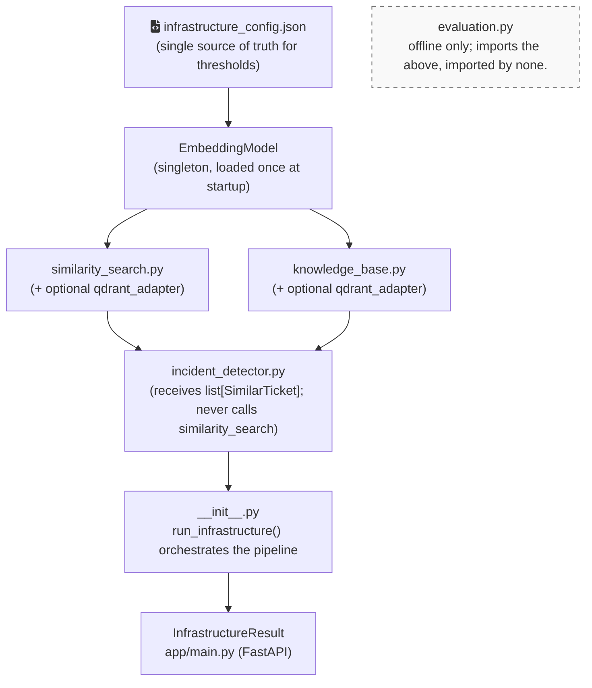

# ServiceDesk Radar — AI Core (Infrastructure)

Embedding-based **similarity search**, **knowledge retrieval**, and **incident
detection** for ServiceDesk Radar — a Persian-first IT support ticket dashboard.

This repository is the **AI Infrastructure** component. Given a new ticket and a
pool of existing tickets, it finds semantically similar past tickets, the most
relevant knowledge-base article, and whether a cluster of related tickets forms a
possible operational incident.

---

## Table of Contents
- [ServiceDesk Radar — AI Core (Infrastructure)](#servicedesk-radar--ai-core-infrastructure)
  - [Table of Contents](#table-of-contents)
  - [What this service does](#what-this-service-does)
  - [Where it fits](#where-it-fits)
  - [Architecture](#architecture)
  - [Folder structure](#folder-structure)
  - [Requirements \& installation](#requirements--installation)
  - [Configuration](#configuration)
  - [Running the service](#running-the-service)
  - [API](#api)
    - [`GET /health`](#get-health)
    - [`POST /analyze-ticket`](#post-analyze-ticket)
  - [Contract with Backend (pool semantics)](#contract-with-backend-pool-semantics)
  - [How it works](#how-it-works)
  - [Optional: Qdrant](#optional-qdrant)
  - [Evaluation](#evaluation)
  - [Design rules](#design-rules)
  - [Testing](#testing)
  - [Degraded mode \& error handling](#degraded-mode--error-handling)
  - [Project status](#project-status)

---

## What this service does

It produces the `intelligence` block for a ticket:

- **Top-5 similar tickets** with cosine similarity scores and a match level
  (`similar` / `very_similar`).
- **The single most relevant knowledge article**, or `null` when nothing clears
  the confidence floor.
- **An incident candidate**: whether several similar tickets in one category form
  a possible incident, its severity (`medium` / `high`), a Persian title and
  reason, the matched ticket IDs, the average similarity, and an `is_duplicate`
  flag.
- Provenance: the embedding model version, the latency in ms, and an `error`
  field that is `null` on success.

It does **not** classify category/intent/urgency or write replies — that is the
separate Analyzer AI. The two are fully independent; the Backend combines them.

---

## Where it fits

ServiceDesk Radar has four independent components:

| Component | Responsibility |
|---|---|
| Frontend (Next.js) | Dashboard — tickets, incidents, KB, alerts |
| Backend (FastAPI) | Data, DB, CSV import, WebSocket, orchestration |
| Analyzer AI | Persian text analysis — category, intent, urgency, sentiment, summary, reply |
| **AI Infrastructure** (this repo) | **Embedding, similarity, knowledge retrieval, incident detection** |

The Backend calls this service over HTTP, passing the new ticket plus the pool of
existing tickets, and stores the returned intelligence block.

---

## Architecture



- **Embedding model:** `sentence-transformers/paraphrase-multilingual-MiniLM-L12-v2`
  (native Persian + mixed Persian/English), loaded exactly once at startup.
- **Vector store:** pure-Python cosine over an in-memory pool is the always-available
  default. **Qdrant is optional** and isolated behind an adapter.

---

## Folder structure

```
ai-core/
├── app/
│   ├── main.py                          # FastAPI app: /health, /analyze-ticket
│   └── infrastructure/
│       ├── __init__.py                  # public API: initialize_infrastructure, run_infrastructure, set_model_for_testing
│       ├── schemas.py                   # all Pydantic models
│       ├── embedding_model.py           # EmbeddingModel singleton, encode(), build_ticket_text()
│       ├── similarity_search.py         # find_similar_tickets()
│       ├── knowledge_base.py            # load_articles(), build_article_embeddings(), find_related_article()
│       ├── incident_detector.py         # detect_incident_candidate()
│       ├── qdrant_adapter.py            # optional Qdrant transport
│       └── evaluation.py                # offline eval (similarity quality, threshold sweep, retrieval category accuracy)
├── config/
│   └── infrastructure_config.json       # all tunable thresholds
├── data/
│   ├── knowledge_articles.json          # 11 seed articles
│   ├── old_tickets.json                 # 55 seed tickets
│   ├── evaluation_set.json              # 60 labeled tickets
│   ├── similarity_pairs.json            # 23 similar + 22 dissimilar ground-truth pairs
│   └── .cache/
│       └── article_embeddings.json      # generated by scripts/seed_embeddings.py
├── scripts/
│   ├── seed_embeddings.py               # build the article-embedding cache
│   └── evaluate_infrastructure.py       # run evals → docs/evaluation.md
├── tests/
│   └── fixtures/                        # small deterministic fixtures for unit/integration tests
│       ├── tickets_small.json
│       ├── articles_small.json
│       ├── similarity_pairs_small.json
│       └── vpn_incident_scenario.json
├── docs/
│   └── evaluation.md                    # written by evaluate_infrastructure.py
├── requirements.txt
├── .env.example
└── README.md
```

---

## Requirements & installation

- Python 3.10+
- Recommended VPS: 2–4 vCPU, 8 GB RAM (the multilingual MiniLM model needs room).

```bash
cd ai-core
python -m venv .venv && source .venv/bin/activate
pip install -r requirements.txt
cp .env.example .env        # adjust as needed
```

---

## Configuration

All tunable **thresholds live in `config/infrastructure_config.json`** — never
hardcoded in Python. Defaults:

```json
{
  "embedding":  { "model_name": "sentence-transformers/paraphrase-multilingual-MiniLM-L12-v2",
                  "model_version": "multilingual-MiniLM-L12-v2-v1", "cache_dir": ".model_cache" },
  "ticket_embeddings": { "cache_path": "data/.cache/ticket_embeddings.json" },
  "similarity": { "top_k": 5, "threshold_similar": 0.70, "threshold_very_similar": 0.85 },
  "knowledge_base": { "article_score_min": 0.70, "cache_path": "data/.cache/article_embeddings.json" },
  "incident_detection": { "similarity_floor": 0.70, "medium_min_tickets": 2,
                          "medium_max_tickets": 3, "high_min_tickets": 4 },
  "qdrant": { "enabled": false, "host": "localhost", "port": 6333,
              "collection_tickets": "tickets", "collection_articles": "articles",
              "fallback_to_python": true, "timeout_seconds": 3 }
}
```

Runtime settings live in `.env` (no thresholds, no secrets). It is loaded at
infrastructure startup; explicit process environment values take precedence.

| Var | Purpose | Default |
|---|---|---|
| `ENVIRONMENT` | `development` / `test` / `production`; gates test-only hooks | `development` |
| `LOG_LEVEL` | logging verbosity | `INFO` |
| `INFRASTRUCTURE_CONFIG_PATH` | path to the config file | `config/infrastructure_config.json` |
| `HF_HOME` | model weight cache dir | `.model_cache` |
| `QDRANT_HOST` / `QDRANT_PORT` / `QDRANT_API_KEY` | optional Qdrant connection | localhost / 6333 / *(empty)* |

> Coherence note: keep `incident_detection.similarity_floor ≤ similarity.threshold_similar`,
> and `medium_max_tickets + 1 == high_min_tickets`. The service warns (not crashes)
> if these drift.

---

## Running the service

**1. Seed the article-embedding cache** (fast subsequent startups):
```bash
python scripts/seed_embeddings.py
# -> Embedded/cached 11 article(s) -> data/.cache/article_embeddings.json
```

**2. Start the API:**
```bash
uvicorn app.main:app --host 0.0.0.0 --port 8001
# Swagger UI at http://localhost:8001/docs
```

**3. Run the evaluation** (writes `docs/evaluation.md`):
```bash
python scripts/evaluate_infrastructure.py
```

---

## API

### `GET /health`
Returns readiness. HTTP **200** when usable (`ok` or `degraded`), **503** when `error`.

```json
{
  "status": "ok",
  "model_loaded": true,
  "model_version": "multilingual-MiniLM-L12-v2-v1",
  "articles_indexed": 11,
  "tickets_in_pool": 55,
  "qdrant_available": false,
  "qdrant_mode": "disabled",
  "startup_latency_ms": 1840.0,
  "error_reason": null
}
```

### `POST /analyze-ticket`
Always returns HTTP **200**; controlled failures appear in the `error` field.

**Request** (`InfrastructureRequest`):
```json
{
  "ticket_id": 101,
  "title": "VPN وصل نمیشه",
  "description": "خطای احراز هویت میده و نیم ساعت دیگه جلسه دارم",
  "category": "vpn",
  "open_incidents": [
    { "incident_id": 7, "category": "vpn", "matched_ticket_ids": [18, 22, 35] }
  ],
  "old_tickets": [
    { "ticket_id": 18, "title": "VPN خطا میده", "description": "...", "category": "vpn", "status": "open" }
  ]
}
```

**Response** (`InfrastructureResult`):
```json
{
  "similar_tickets": [
    { "ticket_id": 18, "similarity": 0.91, "match_level": "very_similar", "title": "VPN خطا میده", "category": "vpn" }
  ],
  "related_article": {
    "article_id": 1, "title": "راهنمای رفع خطای احراز هویت VPN",
    "score": 0.88, "category": "vpn", "tags": ["vpn", "mfa", "authentication"]
  },
  "incident": {
    "possible_incident": true, "severity": "high",
    "fa_title_incident": "رخداد احتمالی در سرویس VPN",
    "fa_reason_incident": "۴ تیکت مشابه با میانگین شباهت ۰.۸۹ در دسته VPN شناسایی شد.",
    "matched_ticket_ids": [18, 22, 35, 41],
    "avg_similarity_score": 0.89, "is_duplicate": false,
    "duplicate_incident_id": null
  },
  "embedding_model_version": "multilingual-MiniLM-L12-v2-v1",
  "latency_ms": 340.5,
  "error": null
}
```

**Mapping to the Taskbook §2.3 `intelligence` block** (the Backend lifts/renames when merging):

| §2.3 `intelligence` field | Source in `InfrastructureResult` |
|---|---|
| `similar_tickets[].ticket_id`, `.similarity` | `similar_tickets[]` (also exposes `match_level`, `title`, `category`) |
| `related_article` | `related_article` (also exposes `category`, `tags`; `null` below the score floor) |
| `possible_incident` | `incident.possible_incident` |
| `incident_title_fa` | `incident.fa_title_incident` |

> This service returns a **richer** incident object (`severity`, `fa_reason_incident`,
> `matched_ticket_ids`, `avg_similarity_score`, `is_duplicate`). The Backend lifts the
> two §2.3 fields out of it and may store the rest.

---

## Contract with Backend (pool semantics)

The complete handoff payload and persistence rules are in
[`docs/backend_integration_contract.md`](../../docs/backend_integration_contract.md).

In the **default mode (Qdrant disabled)**, `/analyze-ticket` searches **only the
`old_tickets` array supplied in the request body** — not the startup seed pool.
The Backend MUST send the relevant pool of existing tickets on every request;
an empty `old_tickets` yields empty `similar_tickets` and no incident (this is valid).

- The startup `seed_ticket_pool` (built from `data/old_tickets.json`) is used for
  the **Qdrant path** and for seeding the Qdrant collections. In the default
  Python path it is not searched.
- `/health` → `tickets_in_pool` reports the size of that **seed** pool, so it is
  only meaningful when Qdrant is enabled. It does not reflect the per-request pool.
- Embeddings of repeated tickets are cached across requests **and service
  restarts**, keyed by ticket ID + text hash + model version. A changed ticket
  text or model version is embedded again; unchanged tickets are not.
- For incident deduplication, the Backend sends `open_incidents` with each
  incident's ID, category, and matched ticket IDs. A candidate is a duplicate
  only when it shares at least one matched ticket with an open incident in the
  same category; `duplicate_incident_id` identifies the incident to update.


---

## How it works

Per request, `run_infrastructure()` runs a fixed pipeline:

1. **Build standardized text** from title + description (+ optional category).
2. **Encode** it into a vector (the model is loaded once and reused).
3. **Find similar tickets** over the pool: cosine similarity, self-match excluded,
   `closed`/`deleted` filtered out, kept only at/above `threshold_similar`, sorted,
   capped at `top_k`.
4. **Find the related article** (nearest article ≥ `article_score_min`, else `null`).
5. **Detect an incident**: among similar tickets in the query's category that are
   at/above `similarity_floor`, `high` if ≥ `high_min_tickets`, `medium` if within
   `medium_min..medium_max`, else none.
6. **Assemble** the result.

Each stage is isolated — a failure in one stage preserves earlier results and is
reported in `error`.

---

## Optional: Qdrant

The service runs entirely without Qdrant (pure-Python cosine). To use Qdrant for
vector search, set `qdrant.enabled = true` in the config and provide host/port.
At startup the adapter health-checks Qdrant (with a `timeout_seconds` guard); if
it is disabled or unreachable, the service logs a warning and silently uses the
Python fallback. Two collections are used: `tickets` and `articles` (cosine
distance, sized to the model's embedding dimension).

---

## Evaluation

`scripts/evaluate_infrastructure.py` runs three offline checks over the full data
files and writes `docs/evaluation.md`:

- **Similarity quality** — average cosine of similar vs dissimilar ground-truth
  pairs, the separation gap (target **> 0.15**), pass rate, and a recommended
  threshold.
- **Threshold sweep** — pass rate across candidate thresholds; recommends the best.
- **Retrieval category accuracy** — for each labeled eval ticket, the nearest
  tickets vote on category; reports overall and per-category accuracy. This
  measures retrieval quality, not the separate Analyzer model.

> **Selected operating threshold:** `similarity.threshold_similar = 0.70`. Among the
> Taskbook §9.8 candidates {0.70, 0.75, 0.78, 0.82}, 0.70 has the highest pass rate
> (0.8889) while the separation gap stays at 0.59 (> 0.15). The lower numbers the
> script prints (0.48 = score midpoint, 0.65 = sweep argmax) are unconstrained
> heuristics; we pin the operating point to a Taskbook-specified value for precision.

The runner performs a pre-flight check that every pair ID resolves in the eval set,
and warns (without changing thresholds) if the separation gap is below target.

---

## Design rules

These invariants are enforced throughout:

1. `run_infrastructure()` never raises — failures surface in the `error` field.
2. `incident_detector.py` never imports `similarity_search.py` (it receives results).
3. The embedding model is never loaded at import time, only on explicit `load()`.
4. All numeric thresholds come from `infrastructure_config.json`.
5. Infrastructure never imports from the Analyzer.
6. `evaluation.py` is offline only — never on the live request path.
7. Every data file is validated; invalid records are skipped with a warning, never crash.
8. The service always works without Qdrant; Python cosine is the default.

---

## Testing

Deterministic fixtures live in `tests/fixtures/` (a 5-VPN + 5-printer pool, small
article set, similarity pairs, and a VPN incident scenario). Each module's behavior
was validated against the milestone acceptance criteria (model-loaded-once, "only
VPN in top-5", self-match guard, deleted/closed filtering, VPN→VPN article ≥ 0.70,
cache-on-second-startup, `high`/`medium` incident bands, Persian title/reason,
never-raise, degraded mode).

`pytest` modules consume these fixtures with a deterministic mock embedding model
(no real model download required): `test_embedding_model.py`, `test_similarity_search.py`,
`test_knowledge_base.py`, `test_incident_detector.py`, `test_pipeline.py`, and
`test_ci_rules.py` (Rule-6 import guard), `test_ticket_embedding_cache.py`,
`test_persian_pipeline.py`, `test_api_resilience.py`, and
`test_config_environment.py`, and `test_evaluation.py` — **22 tests, all passing** (`pytest -q`).

---

## Degraded mode & error handling

- **Model fails to load at startup** → service starts `degraded`: `/health` reports
  `degraded` (HTTP 200), and `/analyze-ticket` returns a neutral result with
  `error: "model_not_ready"`. The service does not crash.
- **Config file missing/invalid** → `/health` reports `error` (HTTP 503).
- **A per-request stage fails** → partial results are preserved and the first error
  is reported in `error`; the Backend treats this as `analysis_status = "partial"`.

---

## Project status

The standalone AI Infrastructure component is ready for the default Python-cosine
mode with Qdrant disabled. Before production, rerun the evaluation with the real
model, confirm the separation gap clears 0.15, and complete the documented
Backend/Analyzer integration contract.
